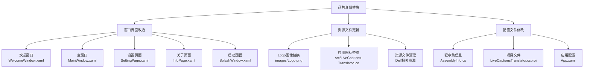
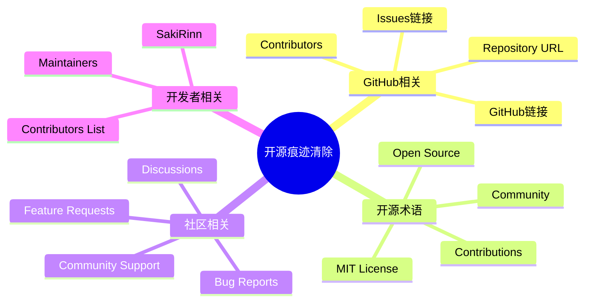
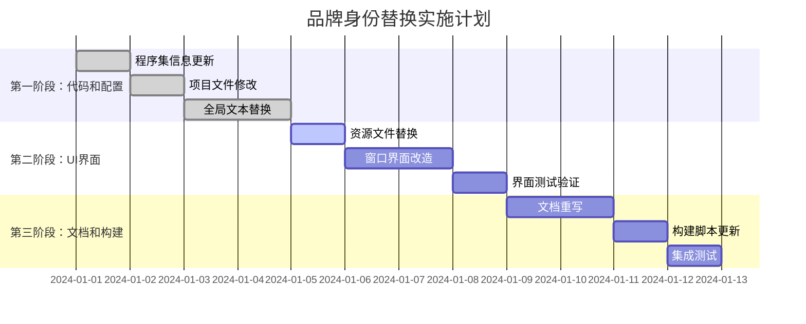

# 品牌身份替换设计文档

## 概述

本设计文档定义了将开源项目"LiveCaptions-Translator"完全商业化并植入"Ai-All-You-Need-Platform Pte. Ltd."品牌标识的系统性改造方案。该改造旨在移除所有开源相关痕迹，建立专业的商业产品形象，确保产品完全符合企业级商业化要求。

### 核心目标

- **品牌标识统一化**：将所有UI界面、文档和配置文件中的品牌元素替换为公司标识
- **开源痕迹清除**：移除所有与开源社区、GitHub、贡献者相关的内容和链接
- **商业化专业呈现**：建立符合企业标准的产品文档和用户界面体验
- **技术完整性保障**：确保改造后的代码库能够成功编译和运行

### 项目背景分析

基于对项目结构的分析，LiveCaptions-Translator是一个基于C#和WPF的Windows桌面应用程序，具有以下特征：

- **技术栈**：.NET 8.0 + WPF + Fluent UI
- **核心功能**：实时字幕翻译，集成Windows Live Captions和本地AI模型
- **架构模式**：模块化设计，清晰的UI、业务逻辑和配置分离
- **当前品牌**：主要标识为Dell Technologies的定制版本

## 品牌身份替换策略

### 公司信息定义

| 属性 | 当前值 | 目标值 |
|------|--------|--------|
| 公司名称 | Dell Technologies | Ai-All-You-Need-Platform Pte. Ltd. |
| 产品名称 | DellLiveCaptionsTranslator | DellLiveCaptionsTranslator (保持不变) |
| 官方网站 | dell.com相关链接 | aiallyouneed.dev |
| 版权信息 | Copyright © 2024 Dell Technologies | Copyright © 2024 Ai-All-You-Need-Platform Pte. Ltd. |
| Logo标识 | Dell Logo | 公司Logo (images/Logo.png) |

### 品牌替换原则

根据更新的要求，品牌替换遵循以下原则：

1. **产品名称保持原则**：所有产品标题保持"DellLiveCaptionsTranslator"不变
2. **公司信息更新原则**：仅更新公司名称和官方网站，不添加其他联系方式
3. **语言统一原则**：项目内容严格使用英文，包括UI文本、文档和代码注释
4. **一致性原则**：所有品牌元素在整个应用程序中保持统一的视觉和文字表达
5. **专业性原则**：商业化后的界面和文档应体现企业级软件的专业水准
6. **完整性原则**：确保没有遗漏任何开源或原始品牌的痕迹
7. **可维护性原则**：改造应便于后续的品牌更新和维护

## 用户界面改造设计

### 窗口和界面组件改造



### 关键界面改造详情

#### 欢迎窗口 (WelcomeWindow.xaml)
- **Logo显示区域**：在窗口顶部或中心位置添加公司Logo (images/Logo.png)
- **标题文本**：保持"DellLiveCaptionsTranslator"产品名称
- **欢迎文本**：移除所有开源、社区、GitHub相关描述
- **版权声明**：添加"© 2024 Ai-All-You-Need-Platform Pte. Ltd."

#### 主窗口 (MainWindow.xaml)
- **窗口标题**：显示产品名称和公司标识
- **状态栏/标题栏**：集成公司品牌元素
- **Logo位置**：在合适位置展示公司Logo

#### 设置页面 (SettingPage.xaml)
- **品牌区域**：在页脚或关于部分添加公司Logo
- **版权信息**：显示完整的公司版权声明
- **网站链接**：添加公司官方网站链接 (aiallyouneed.dev)

#### 关于页面 (InfoPage.xaml)
- **完全重构**：移除所有开源相关链接和文本
- **公司信息**：展示完整的公司名称 "Ai-All-You-Need-Platform Pte. Ltd."
- **官方网站**：链接到aiallyouneed.dev
- **产品信息**：专业的商业产品描述

#### 启动画面 (SplashWindow.xaml)
- **Logo居中显示**：公司Logo作为主要视觉元素
- **产品名称**：清晰显示"DellLiveCaptionsTranslator"
- **加载提示**：符合商业软件标准的用户体验

## 代码和项目文件改造设计

### 程序集元数据更新

#### AssemblyInfo.cs改造方案

| 属性 | 当前值 | 目标值 |
|------|--------|--------|
| AssemblyTitle | "DellLiveCaptionsTranslator" | "DellLiveCaptionsTranslator" (保持不变) |
| AssemblyDescription | "Dell Real-time Speech Translation Tool..." | "Professional Real-time Speech Translation Solution by Ai-All-You-Need-Platform" |
| AssemblyCompany | "Dell Technologies" | "Ai-All-You-Need-Platform Pte. Ltd." |
| AssemblyProduct | "DellLiveCaptionsTranslator" | "Ai-All-You-Need Caption Translator" |
| AssemblyCopyright | "Copyright © 2024 Dell Technologies" | "Copyright © 2024 Ai-All-You-Need-Platform Pte. Ltd." |

#### 项目文件改造方案

**LiveCaptionsTranslator.csproj更新内容**：

| 元素 | 当前值 | 目标值 |
|------|--------|--------|
| Title | "LiveCaptions Translator" | "DellLiveCaptionsTranslator" |
| Description | "A real-time speech translation tool..." | "Professional real-time speech translation solution for enterprise and individual users" |
| Copyright | "Copyright (c) 2024 SakiRinn and other contributors" | "Copyright (c) 2024 Ai-All-You-Need-Platform Pte. Ltd." |
| Authors | "SakiRinn" | "Ai-All-You-Need-Platform Pte. Ltd." |
| ApplicationIcon | 更新为公司Logo图标 | 保持现有路径，替换实际文件 |

### 全局文本替换策略

#### 需要清除的开源相关词汇



#### 替换映射表

| 原始术语 | 替换术语 |
|----------|----------|
| "GitHub" | 删除或替换为"Official Website" |
| "open source" | "Professional Software Solution" |
| "community" | "Users" |
| "contributors" | "Development Team" |
| "SakiRinn" | "Ai-All-You-Need-Platform Pte. Ltd." |
| "MIT License" | 删除 |
| "LiveCaptions-Translator" | "DellLiveCaptionsTranslator" |
| "Dell LiveCaptions Translator" | "DellLiveCaptionsTranslator" |

## 资源文件管理设计

### Logo和图标替换方案

#### 文件替换映射

| 文件路径 | 替换操作 | 说明 |
|----------|----------|------|
| `images/Logo.png` | 用户手动替换 | 公司Logo主文件 |
| `src/LiveCaptions-Translator.ico` | 转换Logo为ICO格式 | 应用程序图标 |
| `src/resources/dell_logo.png` | 删除或替换 | Dell相关资源清理 |

#### Logo使用规范

- **主Logo位置**：欢迎窗口、关于页面、启动画面的中心位置
- **尺寸要求**：根据UI设计自适应缩放
- **格式标准**：PNG格式，支持透明背景
- **品牌一致性**：确保所有界面中Logo的视觉效果统一

### 资源文件组织结构

```
images/
├── Logo.png (公司主Logo)
└── icons/
    ├── app-icon.ico (应用程序图标)
    └── splash-icon.png (启动画面图标)

src/resources/
├── (清理Dell相关资源)
└── company/
    ├── brand-assets.xaml
    └── color-scheme.xaml
```

## 文档改造设计

### 主要文档重构方案

#### README.md完全重写

**新文档结构**：

1. **产品概述**
   - 专业的商业软件介绍
   - 核心价值主张和功能特性
   - 目标用户群体定义

2. **系统要求和安装**
   - 硬件和软件要求
   - 专业的安装指南
   - 快速开始指南

3. **功能特性**
   - 详细的功能介绍
   - 使用场景和优势
   - 技术特点说明

4. **支持和联系**
   - 官方网站：aiallyouneed.dev
   - 商业许可信息

#### 其他文档处理方案

| 文档文件 | 处理方式 | 说明 |
|----------|----------|------|
| README_zh-CN.md | 重写 | 中文版商业化文档 |
| RELEASE_NOTES.md | 修改口吻 | 官方发布说明 |
| LICENSE | 删除 | 移除开源许可证 |
| .github/ | 删除整个目录 | 移除GitHub相关配置 |
| .gitattributes | 保留或删除 | 根据需要决定 |

### 文档内容策略

#### 商业化文档特征

- **专业口吻**：使用企业级软件的正式语言风格
- **价值导向**：强调产品的商业价值和解决方案特性
- **用户焦点**：以用户需求和体验为中心
- **技术权威**：体现技术专业性和可靠性

#### 避免的内容类型

- 开源社区贡献指南
- GitHub工作流程说明
- 开发者协作信息
- 非正式的社区交流用语

## 配置和构建系统适配

### 构建脚本更新

#### 需要更新的构建文件

| 文件 | 更新内容 | 说明 |
|------|----------|------|
| build-installer.bat | 产品名称和路径 | 安装包构建脚本 |
| scripts/build-version.ps1 | 版本信息生成 | 版本管理脚本 |
| scripts/deployment/ | 部署配置 | 企业部署脚本 |

### 安装程序定制

#### NSIS安装脚本适配

基于现有的Dell定制经验，需要更新：

- **安装程序标题**：更新为公司产品名称
- **安装路径**：自定义企业级安装目录
- **品牌元素**：集成公司Logo和版权信息
- **用户体验**：符合商业软件安装标准

### 版本管理策略

#### 版本信息重置

- **版本号规划**：从1.0.0重新开始或继续现有版本
- **版本说明**：更新为商业化产品版本描述
- **更新机制**：适配企业级自动更新服务

## 技术实施方案

### 实施阶段规划



### 质量保证措施

#### 测试验证计划

1. **编译测试**：确保所有更改后代码能够成功编译
2. **功能测试**：验证核心翻译功能正常运行
3. **UI测试**：检查所有界面元素的品牌一致性
4. **集成测试**：验证完整的用户体验流程

#### 风险控制措施

- **版本备份**：在开始改造前创建完整的代码备份
- **分阶段实施**：按模块逐步进行品牌替换
- **回滚计划**：为每个阶段准备回滚方案
- **文档记录**：详细记录所有更改和决策

### 技术依赖分析

#### 外部依赖影响评估

| 依赖项 | 影响分析 | 处理方案 |
|--------|----------|----------|
| WPF-UI框架 | 无影响 | 继续使用 |
| Ollama集成 | 无影响 | 保持现有集成 |
| Windows LiveCaptions | 无影响 | 系统级集成不变 |
| SQLite数据库 | 无影响 | 数据结构保持不变 |

#### 性能影响分析

品牌身份替换主要涉及静态资源和配置文件修改，对应用程序运行时性能无显著影响：

- **UI渲染**：Logo和文本更改不会影响渲染性能
- **内存使用**：资源文件大小变化微小
- **启动时间**：配置加载时间基本不变
- **翻译功能**：核心算法和API调用保持不变

## 预期交付成果

### 完整的修改清单

#### 代码文件修改列表

1. **程序集和项目配置**
   - `src/AssemblyInfo.cs` - 公司信息更新
   - `LiveCaptionsTranslator.csproj` - 项目元数据更新
   - `src/App.xaml` - 应用程序级别配置

2. **用户界面文件**
   - `src/windows/WelcomeWindow.xaml` - 欢迎界面品牌化
   - `src/windows/MainWindow.xaml` - 主窗口标题和品牌
   - `src/pages/SettingPage.xaml` - 设置页面品牌元素
   - `src/pages/InfoPage.xaml` - 关于页面完全重构
   - `src/windows/SplashWindow.xaml` - 启动画面Logo

3. **资源和配置文件**
   - `images/Logo.png` - 公司Logo文件
   - `src/LiveCaptions-Translator.ico` - 应用图标
   - 清理Dell相关资源文件

#### 文档文件处理列表

1. **重写文档**
   - `README.md` - 商业化产品说明
   - `README_zh-CN.md` - 中文版商业化文档
   - `RELEASE_NOTES.md` - 官方发布说明

2. **删除文件**
   - `LICENSE` - 开源许可证
   - `.github/` - GitHub相关配置目录
   - 其他开源项目管理文件

3. **构建脚本更新**
   - `build-installer.bat` - 安装包构建
   - `scripts/build-version.ps1` - 版本管理
   - `scripts/deployment/` - 部署配置

### 成功标准定义

#### 功能完整性验证

- ✅ 应用程序能够成功编译和构建
- ✅ 所有核心功能（翻译、界面、设置）正常运行
- ✅ 安装程序能够正确生成和执行
- ✅ 用户界面显示正确的品牌元素

#### 品牌一致性检查

- ✅ 所有界面元素使用统一的公司品牌标识
- ✅ 文档和帮助信息体现专业商业化风格
- ✅ 版权和法律信息准确完整
- ✅ 无任何开源或原始品牌痕迹残留

#### 用户体验标准

- ✅ 界面美观专业，符合企业级软件标准
- ✅ 品牌元素自然融入，不影响功能使用
- ✅ 文档清晰易懂，便于企业用户理解
- ✅ 安装和使用流程符合商业软件规范

通过系统性的品牌身份替换，最终交付的产品将完全符合"Ai-All-You-Need-Platform Pte. Ltd."的商业化要求，为企业用户提供专业、可靠的实时翻译解决方案。