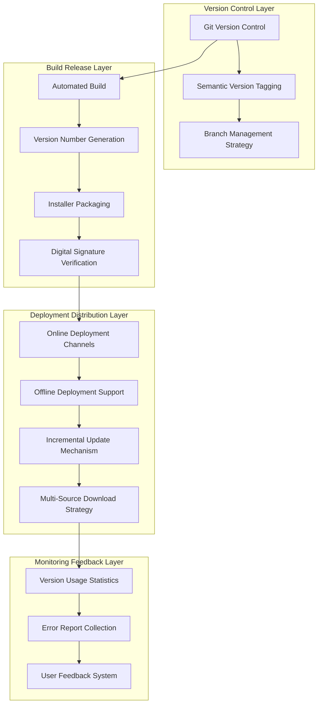
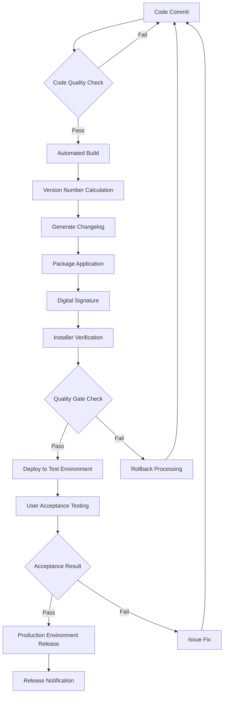
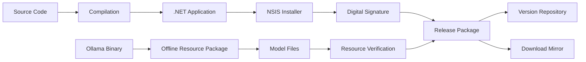
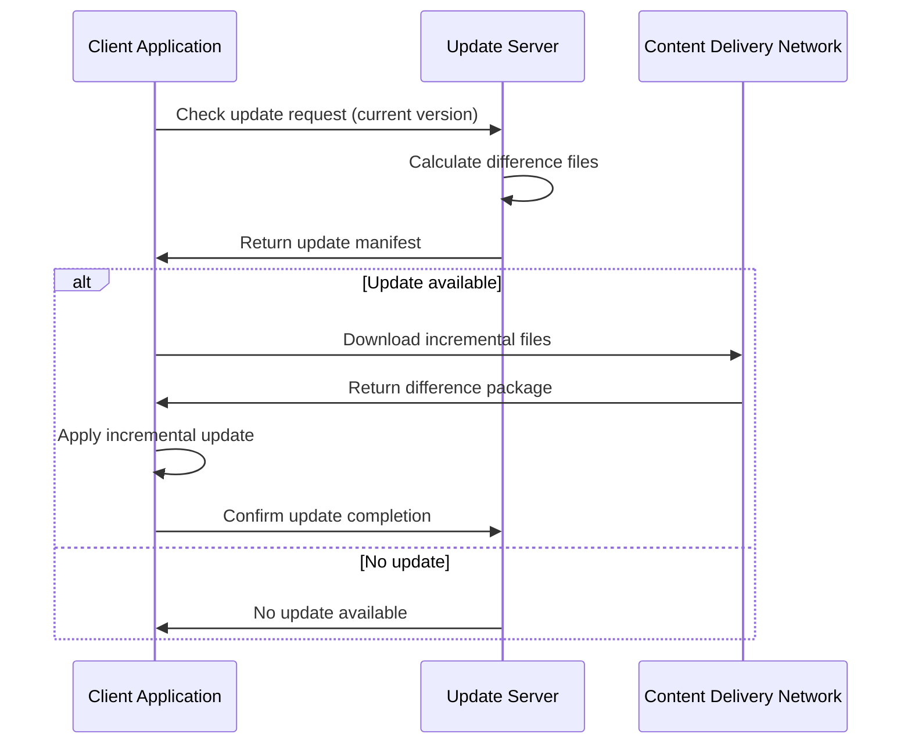
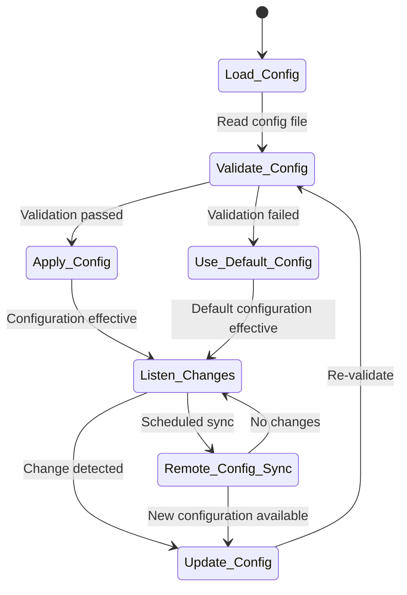
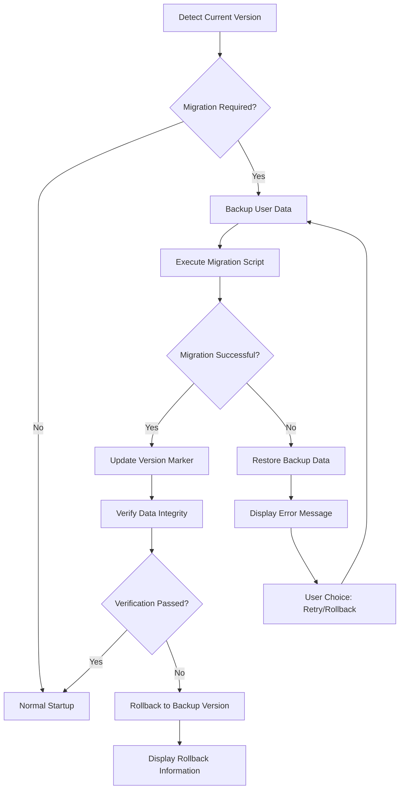
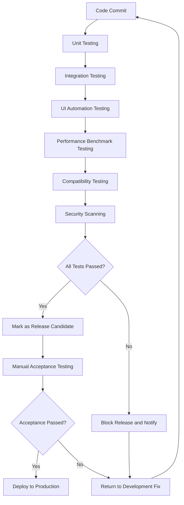
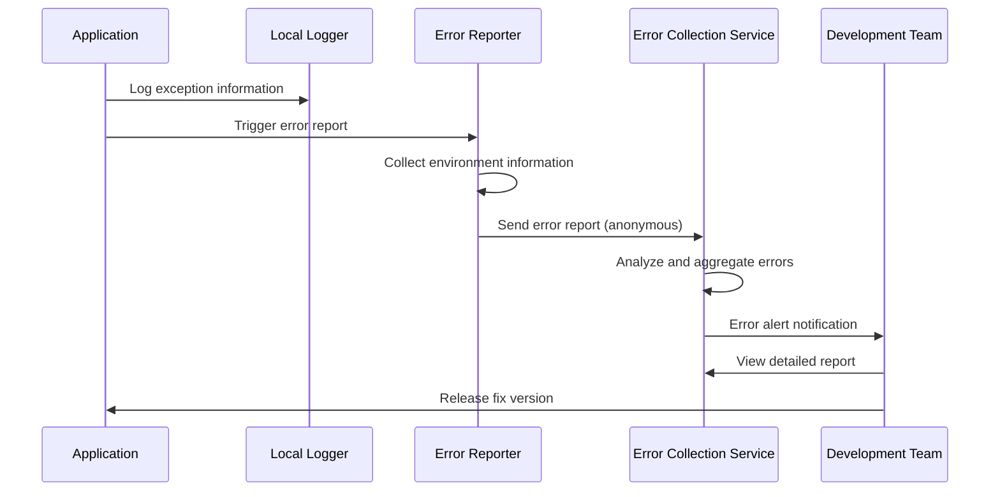
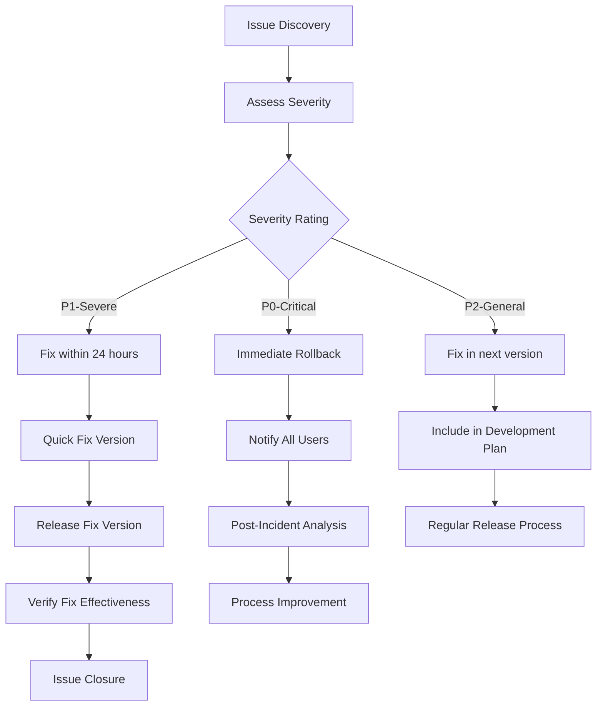

# LiveCaptions-Translator Version Management Enhancement Design

## Overview

This design document provides a comprehensive enhancement to the version management system for the LiveCaptions-Translator desktop application, aiming to establish standardized and automated version control, release management, and deployment processes. The project is a real-time caption translation tool based on WPF, integrating Ollama local AI models and multiple translation API services.

### Project Characteristics
- **Technology Stack**: C# WPF + .NET 8.0
- **Deployment Method**: Windows self-contained application + NSIS installer package
- **Core Dependencies**: Ollama local AI service, Windows Live Captions API
- **Target Users**: Enterprise and individual users requiring real-time translation functionality

## Architecture Design

### Version Management Architecture Overview



### Version Identification System

| Version Type | Format Specification | Example | Applicable Scenarios |
|---------|---------|------|---------|
| Major Version | MAJOR.0.0 | 2.0.0 | Architecture refactoring, major feature changes |
| Minor Version | MAJOR.MINOR.0 | 1.2.0 | New feature additions, API extensions |
| Patch Version | MAJOR.MINOR.PATCH | 1.2.3 | Bug fixes, performance optimizations |
| Pre-release Version | MAJOR.MINOR.PATCH-alpha/beta.N | 1.3.0-beta.1 | Internal testing, public beta versions |
| Build Version | MAJOR.MINOR.PATCH+BUILD | 1.2.3+20241201.1 | Continuous integration builds |

### Branch Management Strategy

```mermaid
gitgraph
    commit id: "Initialize"
    branch develop
    checkout develop
    commit id: "Develop Feature A"
    
    branch feature/version-management
    checkout feature/version-management
    commit id: "Version Management Feature"
    commit id: "Auto Update Mechanism"
    
    checkout develop
    merge feature/version-management
    commit id: "Integrate Version Management"
    
    branch release/v1.2.0
    checkout release/v1.2.0
    commit id: "Prepare Release"
    commit id: "Fix Release Issues"
    
    checkout main
    merge release/v1.2.0
    commit id: "v1.2.0 Release" tag: "v1.2.0"
    
    checkout develop
    merge release/v1.2.0
```

## Version Lifecycle Management

### Development Phase Version Control

| Phase | Version Identifier | Quality Requirements | Validation Method |
|-------|-------------------|---------------------|-------------------|
| Feature Development | feature-YYYYMMDD-description | Feature completeness | Unit testing + functional testing |
| Integration Testing | develop-YYYYMMDD.BUILD | System stability | Automated testing + manual verification |
| Release Candidate | v1.2.0-rc.N | Production ready | Complete regression testing |
| Official Release | v1.2.0 | Release quality | Pre-release validation |

### Version Release Process



## Automated Build System

### Build Configuration Parameters

| Parameter Name | Purpose | Configuration Options |
|----------------|---------|----------------------|
| BuildConfiguration | Build mode | Debug, Release, Enterprise |
| TargetPlatform | Target platform | win-x64, win-x86, win-arm64 |
| SelfContained | Self-contained deployment | true, false |
| PublishSingleFile | Single file publishing | true, false |
| OllamaVersion | Ollama version | Auto-detect or specify |
| SigningCertificate | Code signing certificate | Certificate path or thumbprint |

### Build Artifact Management



## Deployment and Distribution Strategy

### Multi-Channel Distribution Architecture

| Distribution Channel | Target Users | Features | Update Mechanism |
|---------------------|--------------|----------|------------------|
| Official Website | General users | Complete installer package | Manual update check |
| Enterprise Deployment | Enterprise users | Batch deployment package | Unified update management |
| Offline Version | Intranet users | Offline installer package | Offline update package |
| Portable Version | Mobile users | Installation-free version | Automatic update check |

### Update Mechanism Design

#### Incremental Update Strategy



#### Multi-Source Download Retry Mechanism

| Download Source Type | Priority | Features | Failover Strategy |
|---------------------|----------|----------|-------------------|
| Primary Server | 1 | Latest version | Switch after 3 seconds timeout |
| CDN Mirror | 2 | High-speed download | Switch to next on failure |
| Backup Mirror | 3 | Stable and reliable | Circular retry mechanism |
| User-defined Source | 4 | Enterprise intranet | Configurable priority |

### Offline Deployment Support

#### Offline Installer Package Structure

```
offline-installer/
├── DellLiveCaptionsTranslator-Setup.exe     # Main installer program
├── offline-resources/                        # Offline resource directory
│   ├── ollama/                              # Ollama executable files
│   │   ├── ollama.exe
│   │   └── .version                         # Version identifier file
│   ├── models/                              # Pre-downloaded models
│   │   ├── qwen2.5-3b/
│   │   └── model-manifest.json             # Model manifest
│   └── dependencies/                        # System dependencies
│       ├── VC_redist.x64.exe
│       └── .NET8-runtime.exe
├── offline-setup.ps1                        # Offline installation script
└── version-info.json                        # Version information file
```

## Configuration Management System

### Version-Related Configuration Parameters

| Configuration Item | Data Type | Default Value | Description |
|-------------------|-----------|---------------|-------------|
| AutoUpdateEnabled | Boolean | true | Whether to enable automatic update checking |
| UpdateCheckInterval | Integer | 24 | Update check interval (hours) |
| UpdateServerUrls | Array | ["Official Server", "Backup Server"] | Update server list |
| AllowPreReleaseUpdates | Boolean | false | Whether to receive pre-release versions |
| OfflineMode | Boolean | false | Offline mode flag |
| CustomDownloadSources | Object | {} | Custom download source configuration |

### Dynamic Configuration Update Mechanism



## Version Compatibility Management

### API Version Compatibility Strategy

| Component | Compatibility Strategy | Version Support Range |
|-----------|----------------------|------------------------|
| Configuration File Format | Backward compatible | Support for last 3 major versions |
| Ollama API | Adapter pattern | Auto-detect and adapt |
| Translation API Interface | Plugin-based design | Independent version management |
| Database Schema | Incremental migration | Automatic migration mechanism |

### Data Migration Strategy



## Quality Assurance System

### Version Quality Gates

| Quality Gate | Check Items | Pass Criteria | Tools |
|--------------|-------------|---------------|-------|
| Code Quality | Code coverage, complexity | >80% coverage, <10 complexity | SonarQube |
| Functional Testing | Automated test pass rate | 100% core functionality pass | MSTest/NUnit |
| Performance Testing | Startup time, memory usage | <3s startup, <100MB memory | Custom tools |
| Security Scanning | Dependency vulnerability scan | No high-risk vulnerabilities | OWASP Check |
| Compatibility Testing | Multi-Windows version testing | Support Win10/11 | Automated testing |

### Regression Testing Strategy



## Monitoring and Feedback Mechanism

### Version Usage Monitoring

| Monitoring Metric | Data Source | Collection Frequency | Purpose |
|------------------|-------------|---------------------|----------|
| Version Distribution Statistics | Application telemetry | Daily | Understand user upgrade patterns |
| Feature Usage Rate | User behavior analysis | Real-time | Guide feature optimization |
| Error Reports | Crash reporting system | Real-time | Quickly discover and fix issues |
| Performance Metrics | Application performance monitoring | Real-time | Performance optimization decisions |
| User Feedback | In-app feedback | Real-time | Product improvement suggestions |

### Error Handling and Reporting



## Risk Management

### Version Release Risk Assessment

| Risk Type | Risk Level | Impact Scope | Response Strategy |
|-----------|------------|--------------|-------------------|
| Compatibility Breakage | High | All users | Comprehensive regression testing, phased release |
| Performance Regression | Medium | Performance-sensitive users | Performance benchmark testing, monitoring alerts |
| Security Vulnerabilities | High | All users | Security scanning, rapid fix mechanism |
| Dependency Update Risk | Medium | Specific environment users | Dependency locking, test validation |
| Data Loss | High | Historical data users | Automatic backup, migration validation |

### Emergency Response Mechanism


